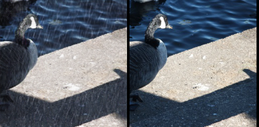

# AddRain-CycleGAN
Add Rain Streak Mask On Unparied Image Using GAN 

- To train the model:

```bash
python train.py --dataroot ./datasets/clean2rain/ --name demo1 --batch_size 2
```

- To test the model:

```bash
python test.py --dataroot ./datasets/clean2rain/ --name demo1 --model test 
```


